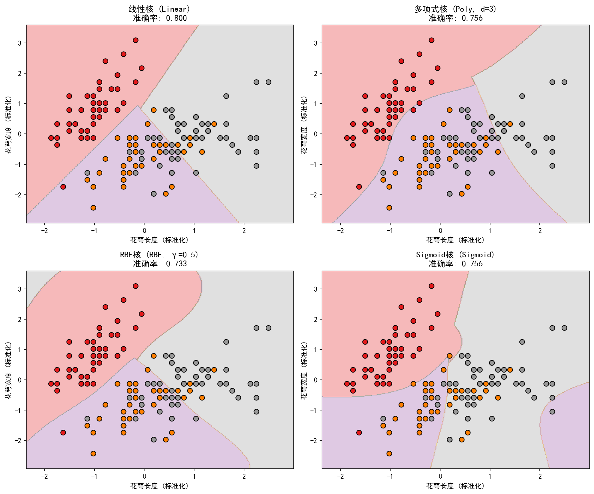
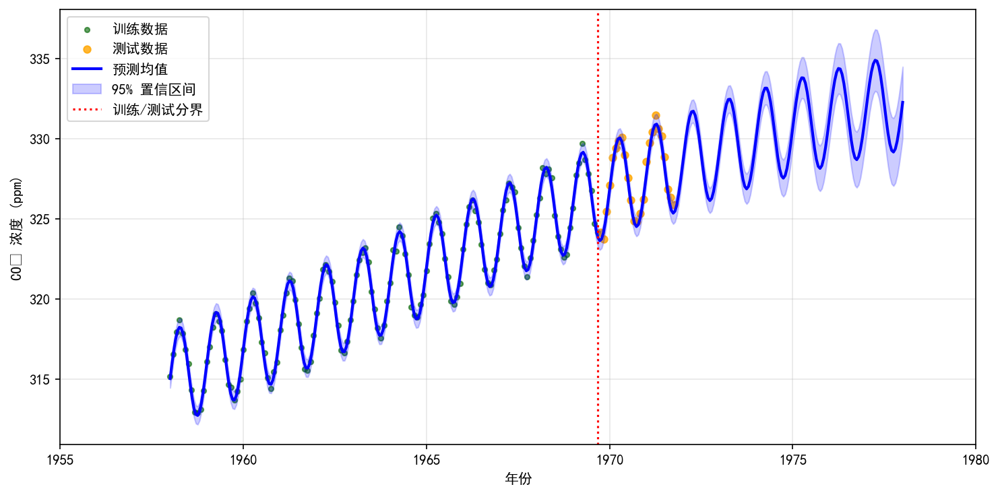

# 基于核方法的机器学习案例工作总结

**姓名：** 李天昊  
**学号：** U202342573  
**日期：** 2026年7月9日  

---

## 摘要

本文基于两个机器学习实践案例展开工作总结：第一个案例使用支持向量机（SVM）的四种核函数对鸢尾花数据集进行分类并对比决策边界；第二个案例使用高斯过程回归（GPR）对CO₂浓度时间序列数据进行建模与预测。两个案例均属于核方法范畴，分别从分类与回归两个角度体现了核函数在机器学习中的重要作用。本文将从数据、方法、结果、分析和总结五个部分进行系统梳理。

---

## 一、数据

### 1.1 SVM分类数据集：鸢尾花（Iris）数据集

鸢尾花数据集是机器学习领域最经典的数据集之一，共包含150个样本，分为3个类别：山鸢尾（Setosa）、变色鸢尾（Versicolour）和维吉尼亚鸢尾（Virginica），每类各50个样本。每个样本包含4个特征：花萼长度（sepal length）、花萼宽度（sepal width）、花瓣长度（petal length）和花瓣宽度（petal width）。

为了方便可视化决策边界，本案例仅使用前两个特征（花萼长度与花萼宽度）作为输入。数据经过 `StandardScaler` 标准化处理，将其转换为均值为0、方差为1的分布。标准化对于SVM至关重要，因为SVM基于距离度量，未标准化的特征会导致距离计算被量纲较大的特征主导。随后按70%训练集、30%测试集的比例划分数据，用于后续模型评估。

### 1.2 GPR回归数据集：CO₂浓度时间序列数据

CO₂浓度数据模拟了夏威夷冒纳罗亚（Mauna Loa）观测站的月度观测记录，时间范围从1958年3月至1971年12月，共166个数据点。数据具有明显的趋势性（长期上升）和周期性（季节性波动）特征：CO₂浓度随年份大致呈线性增长，同时每年呈现一次完整的周期性波动（夏季低、冬季高）。

数据按85%训练集、15%测试集的比例划分，其中训练集包含141个样本，测试集包含25个样本。在模型训练前，对目标变量（CO₂浓度）进行了均值中心化处理，以提升GPR数值优化的稳定性。

---

## 二、方法

### 2.1 SVM核函数对比方法

支持向量机（SVM）是一种基于最大间隔原则的分类算法。对于非线性可分问题，SVM通过核函数将原始特征映射到高维空间，再在高维空间中寻找最优超平面。本案例对比了四种常用核函数：

- **线性核（Linear Kernel）**：直接计算原始特征的内积，适用于线性可分或近似线性可分的数据。决策边界为直线或超平面。
- **多项式核（Polynomial Kernel）**：通过多项式映射捕捉特征间的非线性交互关系。本案例设置 `degree=3`，即使用三次多项式核。
- **RBF核（Radial Basis Function Kernel）**：也称高斯核，通过高斯函数计算样本间的相似度。其参数γ控制了决策边界对样本局部的敏感程度。本案例设置 `γ=0.5`。
- **Sigmoid核（Sigmoid Kernel）**：形式类似于神经网络的激活函数，在某些场景下等价于两层神经网络。

实验中所有核函数的惩罚参数 `C` 均设为1.0，多分类策略采用 `one-vs-rest`（OvR）。对于每个核函数，分别训练模型、预测测试集，并绘制二维决策边界。

### 2.2 高斯过程回归方法

高斯过程回归（GPR）是一种非参数化的贝叶斯回归方法，它通过先验分布和似然函数对数据进行建模，并通过观测数据得到后验分布。GPR的核心在于核函数（协方差函数），它定义了数据点之间的相关性。

本案例采用复合核函数，将三种不同结构的核函数相加：

$$
K = C_1^2 \cdot \text{RBF}(\ell_1) + C_2^2 \cdot \text{ExpSineSquared}(\ell_2, P) + \text{WhiteKernel}(\sigma^2)
$$

其中：
- **$C_1^2 \cdot \text{RBF}$**：RBF核用于建模CO₂浓度的长期平滑趋势。RBF核的长度尺度参数（length_scale）控制趋势的平滑程度，较大的值表示趋势变化缓慢。
- **$C_2^2 \cdot \text{ExpSineSquared}$**：指数正弦平方核用于捕捉数据中的周期性成分。其周期参数（periodicity）固定为1.0，即对应一年一个周期。
- **$\text{WhiteKernel}$**：白噪声核用于建模观测噪声。

模型通过最大化对数边际似然（Log Marginal Likelihood）自动优化核函数的超参数。训练时采用2次随机重启优化，以避免局部最优。

---

## 三、结果

### 3.1 SVM分类结果

四种核函数在鸢尾花测试集上的准确率如下表所示：

| 核函数 | 测试集准确率 |
|--------|--------------|
| 线性核（Linear） | 0.8000 |
| 多项式核（Poly, d=3） | 0.7556 |
| RBF核（γ=0.5） | 0.7333 |
| Sigmoid核（Sigmoid） | 0.7556 |

从结果来看，线性核在该数据集上取得了最高的测试准确率。四种核函数对应的决策边界如下图所示：

**图1：SVM四种核函数在鸢尾花数据集（前两维）上的决策边界对比**

由图1可以观察到：
- 线性核的决策边界为直线，简单直观。
- 多项式核（三次）的决策边界呈现曲线形态，能够适应一定程度的非线性分布。
- RBF核的决策边界最为复杂，呈现高度非线性形态，能够包围孤立样本点。
- Sigmoid核的决策边界也较为复杂，但形状不够规则，容易出现过拟合或边界不平滑的现象。

### 3.2 GPR预测结果

经过优化，GPR的复合核函数参数为：

$$
11.6^2 \cdot \text{RBF}(\text{length\_scale}=20.0) + 5.0^2 \cdot \text{ExpSineSquared}(\text{length\_scale}=4.09, \text{periodicity}=1.0) + \text{WhiteKernel}(\text{noise\_level}=0.0773)
$$

优化后的对数边际似然为 **-44.10**。模型在测试集上的评估指标如下：

| 指标 | 数值 |
|------|------|
| MAE（平均绝对误差） | 0.317 ppm |
| RMSE（均方根误差） | 0.387 ppm |

GPR对训练数据、测试数据以及未来至1978年的预测结果如下图所示：

**图2：高斯过程回归对CO₂浓度的建模与预测结果**

由图2可知，GPR的预测曲线能够很好地拟合训练数据的趋势和季节性波动。在训练数据范围内，95%置信区间较窄；而在测试集及未来外推区域，置信区间逐渐变宽，体现了模型对未知区域预测不确定性的增长。1975—1978年的具体预测结果如下：

| 年份 | 预测CO₂浓度（ppm） | 95%置信区间 |
|------|-------------------|-------------|
| 1975 | 330.55 | ±1.22 |
| 1976 | 331.19 | ±1.50 |
| 1977 | 331.76 | ±1.83 |
| 1978 | 332.26 | ±2.22 |

---

## 四、分析

### 4.1 SVM核函数选择分析

从准确率结果来看，线性核在鸢尾花前两维特征上表现最好，这并不意味着鸢尾花数据整体是线性可分的，而是由于仅使用两个特征时，数据分布恰好呈现出较强的线性可分趋势。RBF核虽然具有强大的非线性建模能力，但准确率最低（0.7333），说明当数据本身具有较好的线性结构时，过于复杂的核函数容易导致过拟合，反而会降低泛化能力。

从决策边界来看，RBF核和Sigmoid核的边界呈现复杂曲折形态，试图对局部噪声进行拟合；而线性核和多项式核的边界相对平滑。这验证了**模型复杂度与数据复杂度相匹配**的原则：核函数并非越复杂越好，而应根据数据分布合理选择。同时，该实验也说明了特征工程的重要性——如果采用全部四个特征，四种核函数的表现差异可能会完全不同。

此外，本实验也体现了SVM对超参数的敏感性。RBF核的γ参数、多项式核的degree参数以及惩罚参数C都会显著影响模型性能。在实际应用中，通常需要通过交叉验证（如网格搜索、随机搜索）进行超参数调优。

### 4.2 GPR复合核函数分析

GPR的结果充分展示了复合核函数的优势。通过将RBF核、指数正弦平方核和白噪声核相加，模型能够同时捕捉数据中的长期趋势、周期性规律和随机噪声。优化后的RBF长度尺度为20.0，说明CO₂浓度长期趋势变化非常缓慢；ExpSineSquared的长度尺度为4.09，周期固定为1.0，对应年度季节性波动。

测试集上的MAE和RMSE分别为0.317 ppm和0.387 ppm，说明模型具有良好的预测精度。更重要的是，GPR提供了预测的不确定性信息。从图中可以看到，在训练数据覆盖范围内，置信区间较窄；而在外推区域，置信区间逐渐扩大。这一特性对于时间序列预测具有重要意义：决策者不仅可以获得点预测值，还能够评估预测的可靠性，从而做出更稳健的决策。

不过，本实验也存在一定的局限性。数据生成时使用了固定的周期性和线性趋势，且优化过程中出现了参数达到边界的警告（如RBF length_scale接近上限20.0）。在实际应用中，应扩大超参数搜索范围，并引入更多真实观测数据，以进一步提升模型性能。

### 4.3 两个案例的共性认识

SVM和GPR虽然分别属于分类和回归任务，但二者都依赖于**核函数**这一核心概念。核函数的本质是隐式地度量样本之间的相似性，并通过特征空间的映射使原本复杂的问题变得可解。在SVM中，核函数用于定义高维空间中的内积；在GPR中，核函数则定义了高斯过程的协方差结构。两者都体现了核方法在机器学习中的强大表达能力。

---

## 五、总结

通过今天的两个案例实践，我对核方法在机器学习中的应用有了更加系统和深入的理解。在SVM分类实验中，我认识到核函数的选择应结合数据分布和任务需求，并非复杂度越高的核函数越好；在GPR回归实验中，我体会到了复合核函数在建模多成分时间序列方面的灵活性和贝叶斯方法在不确定性量化方面的独特优势。

本次工作也暴露出一些需要改进的地方：例如，SVM实验中仅使用了两个特征，未能全面评估四种核函数的真实性能；GPR实验中部分超参数达到了优化边界，提示应扩大搜索范围。在今后的学习中，我将进一步尝试超参数调优、交叉验证、更多特征组合以及更复杂核结构的设计，以提升模型的泛化能力和预测精度。

总体而言，本次实习不仅加深了我对SVM和高斯过程回归理论的理解，也让我掌握了从数据预处理、模型训练、结果可视化到性能分析的完整实验流程，为后续深入学习机器学习奠定了坚实基础。

---

## 附录

### 代码来源
- SVM案例：`C:/xxq/project_four_A.py`
- GPR案例：`C:/xxq/project_three_part_4_A.py`

### 运行环境
- Python 3.x（Anaconda 环境）
- scikit-learn 1.7.2
- matplotlib 3.10.6
- numpy 2.3.5

### 结果文件
- SVM对比图：`C:/xxq/output/svm_kernels_comparison.png`
- GPR预测图：`C:/xxq/output/gpr_co2_prediction.png`
